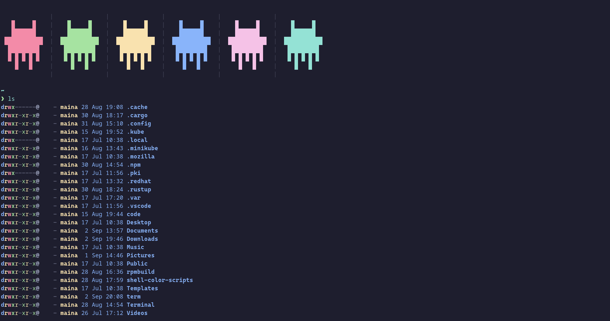
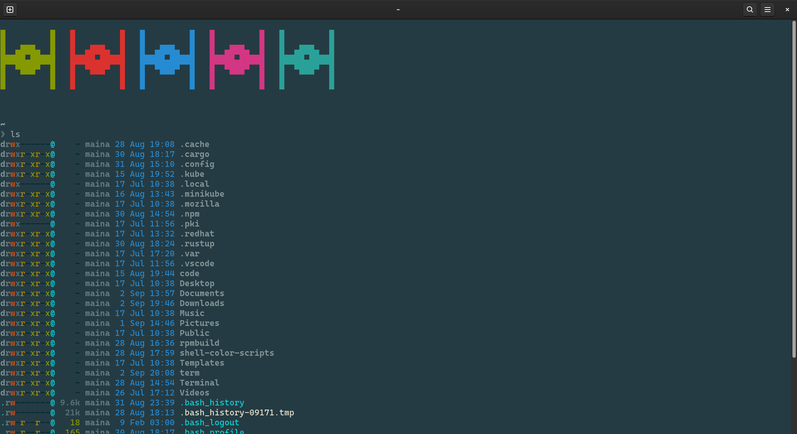

## Setting up Alacritty,Fish and Nerd Font in Fedora.

This project was motivated by Programming Rainbow, Feel free to check out his staff on [Youtube](http://www.youtube.com/@ProgrammingRainbow) and his [github](https://github.com/ProgrammingRainbow).

I was heavily influenced by a [video](https://youtu.be/8bESAW1i9J8) of his where he set up Alacritty, Fish and JetBrains Nerd fonts in Archlinux.
Command for installing Alacritty in fedora is 

## Setting up Alacritty.

Command for installing Alacritty in fedora is 

```
sudo dnf install Alacritty
```

Adding color schemes to Alacritty

```
mkdir -p ~/.config/alacritty/themes
git clone https://github.com/alacritty/alacritty-theme ~/.config/alacritty/themes
```

Now to install Jetbrains nerd font, run,
```
sudo dnf install cascadia-code-nf-fonts
```
If the installation was successfull, in you local terminal you should be able to see the cascadia-code-nf-fonts as an option in the fonts.

After installing navigate to the alacritty.tmol
```
cd .config/alacritty/
```
Open to edit the all the lines with 'Jetbrains nerd font' to 'cascadia-code-nf-fonts' as follows;
```nano alacritty.tmol```
from `family = "JetBrains Mono Nerd Font"` to 
```
family = "Cascadia Code NF"
```
save then exit.
You have successfully installed and configured alacritty.
Feel free to checkout the attached alacritty.tmol file.

## Setting up fish.

To install fish, run the following command,
```sudo dnf install fish```
Add default .config file for fish 
```
mkdir -p ~/.config/fish/config.fish
cp Terminal/.config/fish/config.fish ~/.config/fish/config.fish
```
Install Eza,
```sudo dnf install eza```

And to install starship, switch to su mode then run,
`dnf copr enable atim/starship` to enable the COPR repository which provides the package for fedora. 
```
dnf copr enable atim/starship
```
Now to install
```
dnf install starship
```
Now shell colour script, you can get the color scripts from a handfull github accounts, take care,
[charitarthchugh/shell-color-scripts](https://github.com/charitarthchugh/shell-color-scripts), [shreyas-a-s/shell-color-scripts](https://github.com/shreyas-a-s/shell-color-scripts)
or [faraaz-baig/shell-color-scripts:](https://github.com/faraaz-baig/shell-color-scripts).
To install, clone one github repo, and copy the scripts to your $PATH as shown.  
 
```
git clone https://github.com/faraaz-baig/shell-color-scripts.git
cd shell-color-scripts
rm -rf /opt/shell-color-scripts || return 1
sudo mkdir -p /opt/shell-color-scripts/colorscripts || return 1
sudo cp -rf colorscripts/* /opt/shell-color-scripts/colorscripts
sudo cp colorscript.sh /usr/bin/colorscript
```

Now to change the user default shell 
```chsh -s /bin/fish```
 
You might need to log out then back in or restart your pc. 

If when you open Alacritty your terminal it doesn't automatically load up fish, consider looking in the 
 ```~/.config/fish/config.fish/config.fish``` file from that path out of the `/config.fish` folder 
Try renaming the `config.fish` dir to `config.backup` using
```
mv ~/.config/fish/config.fish ~/.config/fish/config.backup
```
Now move or copy the config.fish
```
cp ~/.config/fish/config.backup/config.fish ~/.config/fish/
```
Again ,You might need to log out then back in or restart your pc for the changes to take effect.

Yep the is it have fun and enjoy yourselves.




